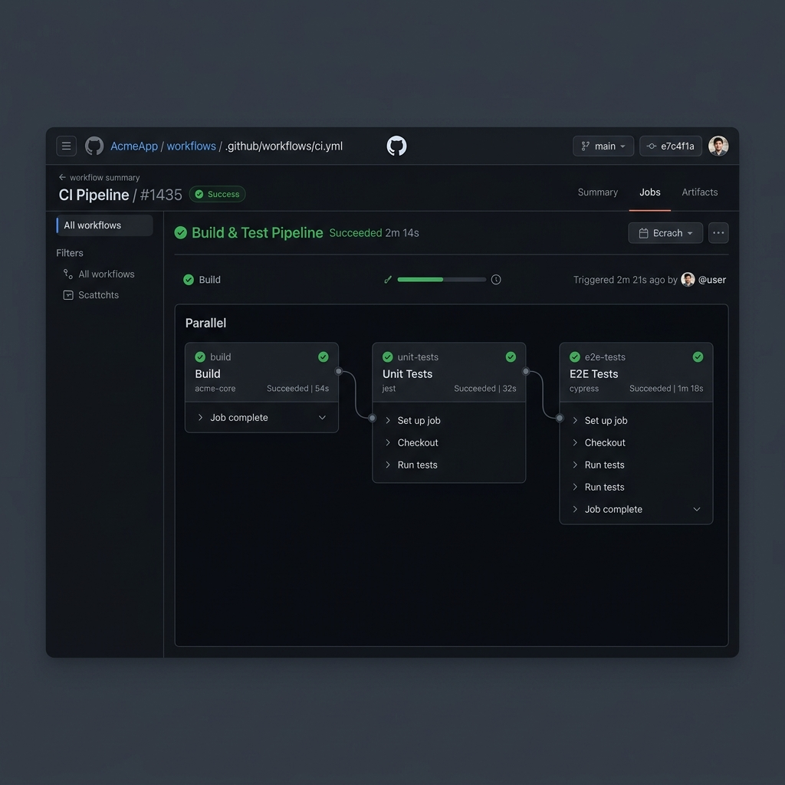

# 📚 library-qa: Full-Stack Test Automation Portfolio Project

[](https://github.com/minhtoanvu/KiemThuBTL_Library/actions)[](https://www.python.org/)
[](https://flask.palletsprojects.com/)
[](https://www.selenium.dev/)
[](https://docs.pytest.org/)
[](LICENSE)

A robust, production-grade **Library Management System** bundled with a comprehensive **QA Test Automation Suite**. This project serves as a showcase of modern software testing practices, including Unit Testing, Integration Testing, and End-to-End (E2E) UI Automation using the Page Object Model (POM) design pattern.

---

## 📌 Table of Contents
1. [🏆 QA & Testing Highlights](#-qa--testing-highlights)
2. [⚙️ Architecture & Tech Stack](#️-architecture--tech-stack)
3. [🚀 Getting Started](#-getting-started)
4. [🧪 Running Tests](#-running-tests)
5. [👤 Author](#-author)

---

## 🏆 QA & Testing Highlights

This project was built with a "Quality-First" mindset to demonstrate proficiency in software testing methodologies and test automation frameworks.




### 📊 Test Case Execution Metrics
Comprehensive test case documentation (`TESTCASE_LIB.xlsx`) covering 6 core modules with **63 Test Cases** (98.41% Pass Rate).

| Module | Features Tested | Total TCs | Pass Rate |
| :--- | :--- | :---: | :---: |
| **B01 - Mượn sách** | Borrow limits, Out of stock, Overdue debts prevention | 15 | 100% |
| **R01 - Trả sách** | On-time, Overdue fines calculation, Double-click prevention | 11 | 100% |
| **F01 - Tìm kiếm** | Search by Book Name, Author, Category | 12 | 91.6% |
| **L01 - Xác thực** | Login flows, Password constraints, Validations | 13 | 100% |
| **M01 - Quản trị User** | User management, Account locking | 7 | 100% |
| **H01 - Thống kê** | Statistics, Borrow/Return History | 5 | 100% |

### 🔬 Test Automation Capabilities
- **End-to-End (E2E) UI Testing:** Automated critical user journeys (Login, Book Borrowing, Search) using **Selenium WebDriver**.
- **Page Object Model (POM):** Implemented POM for UI tests (`BasePage`, `HomePage`, `LoginPage`, `MyBook`) to ensure high maintainability and code reusability.
- **API & Unit Testing:** Thorough backend testing using **Pytest** for business logic (fines calculation, inventory management, authentication).
- **Test Coverage Analysis:** Integrated **pytest-cov** to measure and report code coverage, ensuring high confidence in code quality.
- **Continuous Integration:** Configured GitHub Actions for automated test execution on every push/pull request.

---

## ⚙️ Architecture & Tech Stack

### **Technical Stack**
- **QA Automation:** `Pytest`, `Selenium WebDriver`, `pytest-cov`, `GitHub Actions`
- **Backend:** `Python`, `Flask`, `Flask-SQLAlchemy`, `Flask-Login`
- **Frontend & Database:** `HTML5`, `CSS3`, `Bootstrap`, `SQLite/MySQL`

### **Project Structure**
```text
library-qa/
├── app/
│   ├── dao/                 # Data Access Objects (Database queries)
│   ├── models/              # SQLAlchemy Database Models
│   ├── templates/           # Jinja2 UI Templates
│   └── tests/               # 🧪 QA Automation Suite
│       ├── pages/           # POM: Page Object classes
│       │   ├── BasePage.py
│       │   ├── HomePage.py
│       │   └── LoginPage.py
│       ├── test_*.py        # Pytest Unit & API test files
│       └── test_sel.py      # Selenium E2E test execution
├── docs/                    # Documentation & Assets
│   ├── ci_pipeline.png      
│   └── TESTCASE_LIB.xlsx    # Comprehensive Test Cases
├── scripts/                 # Utility Scripts
│   ├── seed_test_data.py    # Database seeding utility
│   └── create_overdue.py    # Overdue data generation
├── index.py                 # Application entry point
└── requirements.txt         # Project dependencies
```

---

## 🚀 Getting Started

Follow these steps to set up the environment, run the web application, and execute the test suites.

### 1️⃣ Prerequisites
- Python 3.10+
- Git
- Chrome Browser & ChromeDriver (for Selenium E2E tests)

### 2️⃣ Installation & Setup

```bash
# Clone the repository
git clone https://github.com/minhtoanvu/KiemThuBTL_Library.git
cd KiemThuBTL_Library

# Create and activate a virtual environment
python -m venv venv
source venv/bin/activate  # On Windows use `venv\Scripts\activate`

# Install dependencies
pip install -r requirements.txt

# Seed the database with test data
python scripts/seed_test_data.py
```

### 3️⃣ Running the Application

```bash
python index.py
```
The application will be accessible at `http://localhost:5000`.

---

## 🧪 Running Tests

The test suite is modular, allowing you to run specific testing layers.

### Run All Tests
```bash
pytest app/tests/ -v
```

### Run Unit & Integration Tests Only
*(Excludes Selenium UI tests)*
```bash
pytest app/tests/ -v -k "not test_sel"
```

### Run E2E UI Tests (Selenium POM)
```bash
pytest app/tests/test_sel.py -v
```

### Generate Code Coverage Report
```bash
pytest app/tests/ --cov=app --cov-report=term-missing
```

---

## 👤 Author

**Minh**  
*QA Automation Engineer / Software Tester*

*If you are reviewing this repository for a QA/Tester role, I highly recommend checking out the `app/tests/` directory to review the Page Object Model implementation and Pytest configurations.*

---

## 📄 License
© 2026 Minh. Licensed under the [MIT License](LICENSE).
